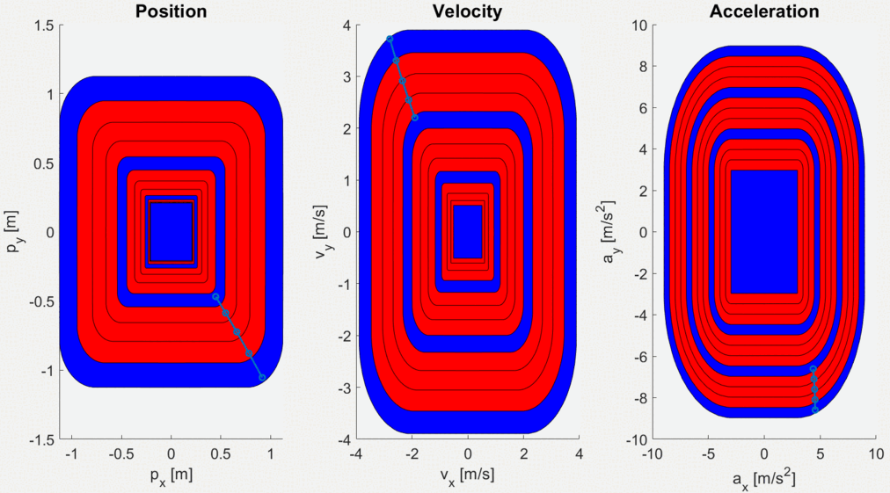

#  Dissertation Repository: Stability Guarantees for Model Predictive Controllers 
This repository contains the code developed for the dissertation "Stability Guarantees for Model Predictive Controllers", submitted to obtain the Master of Science Degree in Electrical and Computer Engineering.
The research was supervised by Prof. Daniel de Matos Silvestre and Prof. Rita Maria Mendes de Almeida Correia da Cunha.
The code implements a Model Predictive Control (MPC) approach to generate optimal trajectories for autonomous drones, ensuring the stability of the controller by the innovative application of Constrained Convex Generators (CCGs) as the primary method for characterising the system's sets. 

# Abstract
The technological advances and growing interest in autonomous vehicles and their applications across various sectors have guided a new era. 
The aerospace domain encompasses vehicles such as spacecrafts for satellite deployment, rocket launches, and Unmanned Aerial Vehicles (UAV) serving purposes like surveillance and transportation. 
These areas demand more robust control strategies to guarantee that the vehicles can effectively interact with external environments and execute complex manoeuvres. 
The traditional control methods may no longer meet the evolving requirements while ensuring feasibility, limiting the system from achieving optimal operational performance.
Motivated by these challenges, the proposed approach implements an Model Predictive Control (MPC) with specific constraints to enforce the system to enter into an invariant set represented as a Constrained Convex Generator (CCG) for reduced conservatism. 
In doing so, the controller inherits feasibility guarantees even with the presence of disturbances. 
Moreover, it is also possible to have a description of the region of attraction for the system to reach the terminal set. 
Simulation results validate the performance of MPC trajectories while confirming that the computational times are suitable for real-time applications.

## Keywords 
Model Predictive Control (MPC), Constrained Convex Generators (CCGs), Region of Attraction, Robust Positively Invariant (RPI), Recursive Feasibility, Stability

# Code organisation
The code in this repository is organised into the following directories and files:

The current directory contains the source code for MPC in 2D (test concept) and 3D (drone test).
  - `MPC3D.m`: Implements the proposed MPC with different initial conditions in a Monte Carlo simulation.
  - `MPC2D.m`: Applies the same methodology to a 2D system.
  - `ComparisonCZvsCCG.m`: Compares results for the region of attraction using  CZs and CCGs in both 2D and 3D.

  ## CCGFunctions
  This folder contains functions related to CCGs.
   - `boxCCG.m`: Returns the interval that overbounds the CCG.
   - `CCGCartesian.m`: Returns the Cartesian Product between 2 CCGs.
   - `CCGmRPI.m`: Returns the mRPI considering the closed-loop system and the disturbances.
   - `CCGIntersect.m`: From ReachTool by danielmsilvestre. Returns the CCG resulting from the intersection between 2 CCGs after a linear map.
   - `CCGIntersect2Sets.m`: Adapted from the setOperations by danielmsilvestre. Returns the CCG resulting from the intersection between 2 CCGs.
   - `CCGLinMap.m`: From ReachTool by danielmsilvestre. Returns the CCG resulting from the linear map between a matrix and a CCG with a vector.
   - `CCGMinkowskiSum.m`: From ReachTool by danielmsilvestre. Returns the CCG resulting from the Minkowski sum between 2 CCGs.
   - `CCGOverbound.m`: Returns trivial CCG overbounding simple sets like norm balls.
   - `CCGReduction.m`: Returns the reduced CCG considering a specific value for reduction.
   - `compileCCG.m`: From ReachTool by danielmsilvestre. Compile the CCG with the tuple information. Returns the constrained set associated with the constrained norm.
   - `compileCCGOptimal.m`: Adapted from `compileCCG.m`. Compile the CCG without the explicit tuple information (only with its size). Returns the constrained set associated with the constrained norm.

   ## MPCFunctions
   This folder contains functions related to MPC.
   - `MPCFormulation.m`: Formulates the objective function and constraints for the MPC with a variable terminal set. Returns the objective function, the constraints and the manageable parameters for varying the terminal set.
   - `MPCSimulation.m`: Simulates an MPC trajectory considering a specific initial condition. Returns an MPC trajectory.

  ## Functions
  This folder contains auxiliary functions that simplify the methodology.
   - `AddZeros.m`: Function created to auxiliate the implementation of an MPC with a variable terminal set. Returns the same CCG but with a higher size due to the zeros added.
   - `BackwardReachabiliySets.m`: Creates the sequence from the RPI to the Region of Attraction considering the system model. Returns the sequence of sets.
   - `FindSet.m`: Returns the index from the sequence of sets where the condition belongs, starting from the smaller to the more extensive set.
   - `ForwardReachabiliySets.m`: Considering the procedure applied on the `BackwardReachabiliySets.m`, create a new sequence with the introduction of an obstacle in the trajectory. It is important to note that this newest list is the same until the obstacle appears. After the obstacle, it changes but can not be larger than the one previously calculated.
   - `Init2D.m`: Returns the model and the sets to initialise the `MPC2D.m`.
   - `InitDrone.m`: Returns the model and the sets to initialise the `MPC3D.m`.
   - `PlotGeral.m`: Plot the sequence of sets in 2D and 3D.
   - `Plot2DIn3D.m`: Plot specifically a 3D visualisation with the discrete-time instants on the x-axis for a sequence of sets in 2D.
   - `PlotSetObstacles.m`: Plot the new sequence with obstacles overlapped with the previous one. It is a feature to visualise the impact of the obstacle along the sequence.
   - `PlotSetObstacles3D.m`: Adapted from `PlotSetObstacles.m` for 3D sets.
   - `PlotSetObsIdx.m`: Plot the set Xi and Oi from the sequence considering the obstacle introduction at i
   - `PlotSets.m`: Plot the constraint sets.
   - `SetReduction.m`: Compute the value that needs to be reduced around a set considering the solver's numerical error. Returns the CCG reduced.

# Instructions
In order to run this code, the external solver GUROBI (https://www.gurobi.com/downloads/gurobi-software/) and MOSEK (https://www.mosek.com/downloads/) should be installed on MATLAB.
The CCGs are directly encoded in YALMIP using the Reach Toolbox (https://github.com/danielmsilvestre/ReachTool).

# Results
The document that has been submitted can be found in the primary directory, and it contains all the presented results.

## Sequence of backwards reachable sets
The figure below displays the sets generated within the sequence (for a 2D simulation), ranging from the region of attraction (larger set) to the mRPI (smaller set).

## MPC Trajectory
The following illustration represents the MPC prediction (for a 2D simulation) at each discrete-time instant, followed by the final trajectory.
